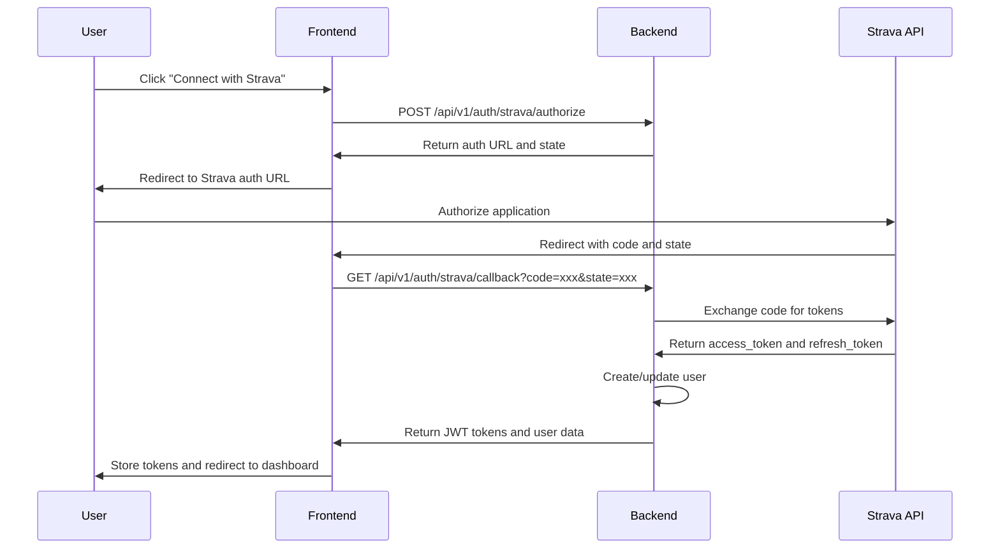
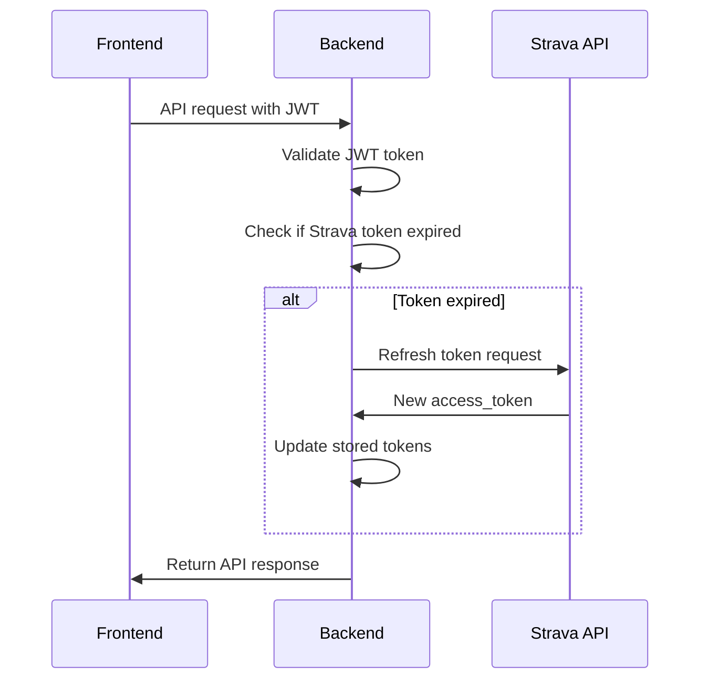

# Authentication System Implementation Plan

## Introduction

This document outlines the detailed implementation plan for the StravaAI authentication system. The authentication system is a critical component that handles Strava OAuth 2.0 integration, user session management, and security for the entire application.

### Core Objectives:
- **Strava OAuth Integration**: Secure OAuth 2.0 flow with Strava API
- **Token Management**: Automatic token refresh and secure storage
- **User Session Management**: JWT-based session handling
- **Security**: Comprehensive security measures and validation
- **User Onboarding**: Seamless user registration and profile setup

---

## Strategy

### Strategy 1: JWT-Based Authentication with Strava OAuth (RECOMMENDED)

**Approach**: JWT tokens for session management with Strava OAuth for authentication
- **Pros**: 
  - Stateless authentication
  - Easy to scale and deploy
  - Secure token-based sessions
  - Standard OAuth 2.0 implementation
- **Cons**: 
  - Token size limitations
  - Manual token refresh handling

**Technology Stack**:
- **OAuth Provider**: Strava OAuth 2.0
- **Session Management**: JWT tokens
- **Token Storage**: Encrypted MongoDB storage
- **Security**: bcrypt for password hashing (if needed)
- **Validation**: Pydantic models for request validation

### Strategy 2: Session-Based Authentication

**Approach**: Server-side sessions with Redis storage
- **Pros**: 
  - Better security control
  - Easy session revocation
  - Smaller token size
- **Cons**: 
  - Stateful authentication
  - More complex deployment
  - Additional infrastructure dependency

### Strategy 3: Hybrid Approach

**Approach**: JWT for API access, sessions for web interface
- **Pros**: 
  - Best of both worlds
  - Flexible authentication
- **Cons**: 
  - Increased complexity
  - More code to maintain

**Recommendation**: Strategy 1 (JWT-based) is optimal for Pre-MVP due to simplicity, scalability, and ease of implementation.

---

## Executive Checklist

### Phase 1: Strava OAuth Setup (Week 1)

#### 1.1 Strava Application Registration
- [ ] Register application with Strava API
  - **Steps**:
    1. Go to https://www.strava.com/settings/api
    2. Create new application
    3. Set redirect URI: `http://localhost:8000/api/v1/auth/strava/callback`
    4. Note Client ID and Client Secret
  - **Configuration**:
    - Application Name: StravaAI
    - Category: Analytics
    - Website: (your domain)
    - Authorization Callback Domain: localhost:8000

#### 1.2 Environment Configuration
- [ ] Set up environment variables
  ```bash
  # Strava OAuth
  STRAVA_CLIENT_ID=your_client_id
  STRAVA_CLIENT_SECRET=your_client_secret
  STRAVA_REDIRECT_URI=http://localhost:8000/api/v1/auth/strava/callback
  
  # JWT Configuration
  JWT_SECRET_KEY=your_jwt_secret_key
  JWT_ALGORITHM=HS256
  JWT_ACCESS_TOKEN_EXPIRE_MINUTES=30
  JWT_REFRESH_TOKEN_EXPIRE_DAYS=7
  
  # Security
  SECRET_KEY=your_secret_key
  ENCRYPTION_KEY=your_encryption_key
  ```

#### 1.3 OAuth Flow Implementation
- [ ] Implement OAuth authorization endpoint
  ```python
  @router.post("/strava/authorize")
  async def strava_authorize(redirect_uri: Optional[str] = None):
      """
      Initiates Strava OAuth flow
      """
      state = generate_random_state()
      auth_url = f"https://www.strava.com/oauth/authorize?client_id={STRAVA_CLIENT_ID}&response_type=code&redirect_uri={STRAVA_REDIRECT_URI}&state={state}&scope=read,activity:read_all"
      return {"auth_url": auth_url, "state": state}
  ```

- [ ] Implement OAuth callback endpoint
  ```python
  @router.get("/strava/callback")
  async def strava_callback(code: str, state: str):
      """
      Handles Strava OAuth callback
      """
      # Validate state parameter
      # Exchange code for tokens
      # Create or update user
      # Generate JWT tokens
      # Return user data and tokens
  ```

### Phase 2: Token Management System (Week 1-2)

#### 2.1 Token Storage Implementation
- [ ] Create encrypted token storage
  ```python
  class TokenStorage:
      def __init__(self, encryption_key: str):
          self.encryption_key = encryption_key
      
      def encrypt_token(self, token: str) -> str:
          # Encrypt token using Fernet
          pass
      
      def decrypt_token(self, encrypted_token: str) -> str:
          # Decrypt token using Fernet
          pass
  ```

#### 2.2 Token Refresh Mechanism
- [ ] Implement automatic token refresh
  ```python
  async def refresh_strava_token(refresh_token: str) -> dict:
      """
      Refreshes expired Strava access token
      """
      url = "https://www.strava.com/oauth/token"
      data = {
          "client_id": STRAVA_CLIENT_ID,
          "client_secret": STRAVA_CLIENT_SECRET,
          "grant_type": "refresh_token",
          "refresh_token": refresh_token
      }
      response = await httpx.post(url, data=data)
      return response.json()
  ```

#### 2.3 JWT Token Implementation
- [ ] Create JWT token utilities
  ```python
  class JWTHandler:
      def __init__(self, secret_key: str, algorithm: str = "HS256"):
          self.secret_key = secret_key
          self.algorithm = algorithm
      
      def create_access_token(self, data: dict, expires_delta: timedelta = None) -> str:
          # Create JWT access token
          pass
      
      def create_refresh_token(self, data: dict, expires_delta: timedelta = None) -> str:
          # Create JWT refresh token
          pass
      
      def verify_token(self, token: str) -> dict:
          # Verify and decode JWT token
          pass
  ```

### Phase 3: User Management System (Week 2)

#### 3.1 User Data Models
- [ ] Create user models
  ```python
  class User(BaseModel):
      id: Optional[ObjectId] = Field(default_factory=ObjectId, alias="_id")
      strava_id: int
      username: str
      firstname: str
      lastname: str
      email: Optional[str] = None
      age: Optional[int] = None
      weight: Optional[float] = None
      city: Optional[str] = None
      country: Optional[str] = None
      access_token: str  # Encrypted
      refresh_token: str  # Encrypted
      token_expires_at: datetime
      last_activity_sync: Optional[datetime] = None
      created_at: datetime = Field(default_factory=datetime.utcnow)
      updated_at: datetime = Field(default_factory=datetime.utcnow)
      
      class Config:
          allow_population_by_field_name = True
          json_encoders = {ObjectId: str}
  ```

#### 3.2 User Registration Flow
- [ ] Implement user registration
  ```python
  async def register_user(strava_data: dict, tokens: dict) -> User:
      """
      Registers new user from Strava OAuth data
      """
      # Check if user exists
      # Create new user if not exists
      # Store encrypted tokens
      # Return user data
  ```

#### 3.3 User Profile Management
- [ ] Create profile update endpoints
  ```python
  @router.put("/users/profile")
  async def update_profile(
      profile_data: UserProfileUpdate,
      current_user: User = Depends(get_current_user)
  ):
      """
      Updates user profile information
      """
      # Validate profile data
      # Update user profile
      # Return updated profile
  ```

### Phase 4: Security Implementation (Week 2)

#### 4.1 Security Middleware
- [ ] Implement security headers
  ```python
  @app.middleware("http")
  async def add_security_headers(request: Request, call_next):
      response = await call_next(request)
      response.headers["X-Content-Type-Options"] = "nosniff"
      response.headers["X-Frame-Options"] = "DENY"
      response.headers["X-XSS-Protection"] = "1; mode=block"
      response.headers["Strict-Transport-Security"] = "max-age=31536000; includeSubDomains"
      return response
  ```

#### 4.2 Rate Limiting
- [ ] Implement rate limiting
  ```python
  from slowapi import Limiter, _rate_limit_exceeded_handler
  from slowapi.util import get_remote_address
  from slowapi.errors import RateLimitExceeded
  
  limiter = Limiter(key_func=get_remote_address)
  app.state.limiter = limiter
  app.add_exception_handler(RateLimitExceeded, _rate_limit_exceeded_handler)
  
  @router.post("/auth/strava/authorize")
  @limiter.limit("5/minute")
  async def strava_authorize(request: Request):
      # Implementation
  ```

#### 4.3 Input Validation
- [ ] Create validation schemas
  ```python
  class UserProfileUpdate(BaseModel):
      name: Optional[str] = Field(None, min_length=1, max_length=100)
      age: Optional[int] = Field(None, ge=1, le=120)
      weight: Optional[float] = Field(None, ge=20, le=300)
      
      @validator('name')
      def validate_name(cls, v):
          if v and not v.strip():
              raise ValueError('Name cannot be empty')
          return v.strip() if v else v
  ```

### Phase 5: User Onboarding (Week 2)

#### 5.1 Onboarding Flow
- [ ] Create onboarding endpoints
  ```python
  @router.post("/users/onboarding")
  async def complete_onboarding(
      onboarding_data: UserOnboarding,
      current_user: User = Depends(get_current_user)
  ):
      """
      Completes user onboarding process
      """
      # Validate onboarding data
      # Update user profile
      # Create milestones
      # Return completion status
  ```

#### 5.2 Milestone Management
- [ ] Implement milestone system
  ```python
  class Milestone(BaseModel):
      id: Optional[ObjectId] = Field(default_factory=ObjectId, alias="_id")
      name: str = Field(..., min_length=1, max_length=200)
      date: datetime
      target: str = Field(..., min_length=1, max_length=100)
      sport_type: str = Field(..., regex="^(Swim|Run|Ride)$")
      distance: float = Field(..., gt=0)
      created_at: datetime = Field(default_factory=datetime.utcnow)
      updated_at: datetime = Field(default_factory=datetime.utcnow)
  ```

### Phase 6: Testing & Validation (Week 2-3)

#### 6.1 Unit Tests
- [ ] Create authentication tests
  ```python
  class TestAuthentication:
      def test_strava_oauth_flow(self):
          # Test OAuth authorization
          pass
      
      def test_token_refresh(self):
          # Test token refresh mechanism
          pass
      
      def test_jwt_token_validation(self):
          # Test JWT token validation
          pass
  ```

#### 6.2 Integration Tests
- [ ] Create integration tests
  ```python
  class TestAuthIntegration:
      async def test_full_oauth_flow(self):
          # Test complete OAuth flow
          pass
      
      async def test_user_registration(self):
          # Test user registration
          pass
  ```

#### 6.3 Security Tests
- [ ] Create security tests
  ```python
  class TestSecurity:
      def test_token_encryption(self):
          # Test token encryption
          pass
      
      def test_rate_limiting(self):
          # Test rate limiting
          pass
  ```

---

## Technical Implementation Details

### OAuth Flow Sequence



### Token Management Flow



### Security Considerations

#### Token Security
- **Encryption**: All tokens stored encrypted using Fernet
- **Expiration**: Automatic token expiration and refresh
- **Validation**: JWT signature validation
- **Storage**: Secure MongoDB storage with encryption

#### API Security
- **Rate Limiting**: 5 requests per minute for auth endpoints
- **CORS**: Configured for frontend domain
- **Validation**: Input validation and sanitization
- **Headers**: Security headers for all responses

#### Data Protection
- **Encryption**: Sensitive data encrypted at rest
- **Validation**: All input validated and sanitized
- **Access Control**: Role-based access control
- **Audit Logging**: Authentication events logged

---

## Error Handling

### OAuth Errors
```python
class OAuthError(Exception):
    def __init__(self, message: str, error_code: str = None):
        self.message = message
        self.error_code = error_code
        super().__init__(self.message)

async def handle_oauth_error(error: OAuthError):
    return JSONResponse(
        status_code=400,
        content={
            "error": "oauth_error",
            "message": error.message,
            "error_code": error.error_code
        }
    )
```

### Token Errors
```python
class TokenError(Exception):
    def __init__(self, message: str, error_type: str = "token_error"):
        self.message = message
        self.error_type = error_type
        super().__init__(self.message)

async def handle_token_error(error: TokenError):
    return JSONResponse(
        status_code=401,
        content={
            "error": error.error_type,
            "message": error.message
        }
    )
```

---

## Monitoring & Logging

### Authentication Events
```python
import structlog

logger = structlog.get_logger()

async def log_auth_event(event_type: str, user_id: str, details: dict = None):
    logger.info(
        "auth_event",
        event_type=event_type,
        user_id=user_id,
        details=details or {},
        timestamp=datetime.utcnow().isoformat()
    )
```

### Security Monitoring
- **Failed Login Attempts**: Track and alert on multiple failures
- **Token Refresh Failures**: Monitor token refresh success rate
- **OAuth Errors**: Track OAuth flow failures
- **Rate Limit Violations**: Monitor rate limit hits

---

## Success Metrics

### Technical Metrics
- OAuth success rate > 95%
- Token refresh success rate > 99%
- API response time < 200ms
- Error rate < 1%

### Security Metrics
- Zero security vulnerabilities
- 100% token encryption
- Successful security tests
- Compliance with OAuth 2.0 standards

---

## Timeline Summary

| Week | Focus | Key Deliverables |
|------|-------|------------------|
| 1 | OAuth Setup | Strava integration, basic auth flow |
| 2 | Token Management | JWT implementation, token refresh |
| 2-3 | Security & Testing | Security measures, comprehensive testing |

**Total Estimated Time**: 2-3 weeks for complete authentication system
**Dependencies**: Strava API access, MongoDB setup
**Risk Level**: Medium (OAuth complexity, security requirements) 