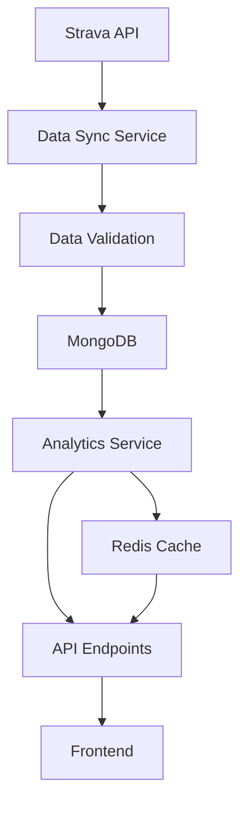

# Data Processing & Analytics Implementation Plan

## Introduction

This document outlines the comprehensive implementation plan for the StravaAI data processing and analytics system. The system is responsible for ingesting Strava activity data, processing it into meaningful metrics, and providing analytics for the frontend dashboard.

### Core Objectives:
- **Data Ingestion**: Efficient Strava activity data fetching and storage
- **Data Processing**: Real-time metrics calculation and data transformation
- **Analytics Engine**: Trend analysis and performance insights
- **Data Visualization**: API endpoints for chart data and metrics
- **Performance Optimization**: Caching and query optimization
- **Data Quality**: Validation, cleaning, and error handling

---

## Strategy

### Strategy 1: Real-time Processing with Caching (RECOMMENDED)

**Approach**: Real-time data processing with Redis caching for performance
- **Pros**: 
  - Fast response times for user queries
  - Real-time analytics updates
  - Efficient resource utilization
  - Scalable architecture
- **Cons**: 
  - More complex caching logic
  - Additional infrastructure dependency

**Technology Stack**:
- **Database**: MongoDB with Motor (async driver)
- **Caching**: Redis for session and analytics caching
- **Processing**: Async Python with asyncio
- **Analytics**: Pandas for data analysis
- **Validation**: Pydantic models for data validation
- **Background Jobs**: Celery for heavy processing tasks

### Strategy 2: Batch Processing

**Approach**: Scheduled batch processing of analytics data
- **Pros**: 
  - Simpler implementation
  - Lower resource usage
  - Predictable processing times
- **Cons**: 
  - Delayed analytics updates
  - Less responsive user experience
  - Complex scheduling logic

### Strategy 3: Hybrid Approach

**Approach**: Real-time for critical data, batch for heavy analytics
- **Pros**: 
  - Balanced performance and complexity
  - Cost-effective resource usage
- **Cons**: 
  - More complex architecture
  - Harder to maintain

**Recommendation**: Strategy 1 (Real-time with caching) is optimal for Pre-MVP due to better user experience and faster development.

---

## Executive Checklist

### Phase 1: Data Models & Schema Design (Week 1)

#### 1.1 Database Schema Implementation
- [ ] Create optimized MongoDB collections
  ```python
  # Users Collection
  class User(BaseModel):
      id: Optional[ObjectId] = Field(default_factory=ObjectId, alias="_id")
      strava_id: int
      username: str
      firstname: str
      lastname: str
      email: Optional[str] = None
      age: Optional[int] = None
      weight: Optional[float] = None
      city: Optional[str] = None
      country: Optional[str] = None
      access_token: str  # Encrypted
      refresh_token: str  # Encrypted
      token_expires_at: datetime
      last_activity_sync: Optional[datetime] = None
      preferences: Dict[str, Any] = Field(default_factory=dict)
      created_at: datetime = Field(default_factory=datetime.utcnow)
      updated_at: datetime = Field(default_factory=datetime.utcnow)
  ```

- [ ] Create activity data models
  ```python
  # Activities Collection
  class Activity(BaseModel):
      id: Optional[ObjectId] = Field(default_factory=ObjectId, alias="_id")
      user_id: ObjectId
      strava_activity_id: int
      name: str
      type: str  # "Swim", "Run", "Ride"
      sport_type: str
      distance: float  # meters
      moving_time: int  # seconds
      elapsed_time: int  # seconds
      total_elevation_gain: float  # meters
      average_speed: float  # m/s
      max_speed: float  # m/s
      average_heartrate: Optional[float] = None  # bpm
      max_heartrate: Optional[float] = None  # bpm
      start_date: datetime
      start_date_local: datetime
      timezone: str
      location_city: Optional[str] = None
      location_state: Optional[str] = None
      location_country: Optional[str] = None
      map: Optional[Dict[str, Any]] = None
      metrics: Dict[str, Any] = Field(default_factory=dict)
      raw_data: Dict[str, Any]  # Full Strava response
      created_at: datetime = Field(default_factory=datetime.utcnow)
      updated_at: datetime = Field(default_factory=datetime.utcnow)
  ```

#### 1.2 Database Indexes
- [ ] Create performance indexes
  ```python
  # Users collection indexes
  db.users.create_index("strava_id", unique=True)
  db.users.create_index("username")
  db.users.create_index("created_at")
  
  # Activities collection indexes
  db.activities.create_index([("user_id", 1), ("start_date", -1)])
  db.activities.create_index([("user_id", 1), ("type", 1), ("start_date", -1)])
  db.activities.create_index("strava_activity_id", unique=True)
  db.activities.create_index("start_date")
  ```

#### 1.3 Data Validation Schemas
- [ ] Create Pydantic validation models
  ```python
  class ActivityCreate(BaseModel):
      strava_activity_id: int
      name: str = Field(..., min_length=1, max_length=200)
      type: str = Field(..., regex="^(Swim|Run|Ride)$")
      sport_type: str
      distance: float = Field(..., gt=0)
      moving_time: int = Field(..., gt=0)
      elapsed_time: int = Field(..., gt=0)
      total_elevation_gain: float = Field(..., ge=0)
      average_speed: float = Field(..., ge=0)
      max_speed: float = Field(..., ge=0)
      average_heartrate: Optional[float] = Field(None, ge=0, le=300)
      max_heartrate: Optional[float] = Field(None, ge=0, le=300)
      start_date: datetime
      start_date_local: datetime
      timezone: str
      location_city: Optional[str] = None
      location_state: Optional[str] = None
      location_country: Optional[str] = None
      map: Optional[Dict[str, Any]] = None
      raw_data: Dict[str, Any]
  ```

### Phase 2: Strava Data Integration (Week 1-2)

#### 2.1 Strava API Client
- [ ] Implement Strava API client
  ```python
  class StravaClient:
      def __init__(self, access_token: str):
          self.access_token = access_token
          self.base_url = "https://www.strava.com/api/v3"
          self.headers = {
              "Authorization": f"Bearer {access_token}",
              "Content-Type": "application/json"
          }
      
      async def get_activities(self, page: int = 1, per_page: int = 200) -> List[Dict]:
          """Fetch user activities from Strava"""
          url = f"{self.base_url}/athlete/activities"
          params = {
              "page": page,
              "per_page": per_page
          }
          async with httpx.AsyncClient() as client:
              response = await client.get(url, headers=self.headers, params=params)
              response.raise_for_status()
              return response.json()
      
      async def get_activity(self, activity_id: int) -> Dict:
          """Fetch specific activity details"""
          url = f"{self.base_url}/activities/{activity_id}"
          async with httpx.AsyncClient() as client:
              response = await client.get(url, headers=self.headers)
              response.raise_for_status()
              return response.json()
  ```

#### 2.2 Data Synchronization
- [ ] Implement data sync service
  ```python
  class DataSyncService:
      def __init__(self, db: Database, strava_client: StravaClient):
          self.db = db
          self.strava_client = strava_client
      
      async def sync_user_activities(self, user_id: ObjectId, force_sync: bool = False) -> Dict:
          """Sync user activities from Strava"""
          # Check last sync time
          # Fetch activities from Strava
          # Process and store activities
          # Update last sync time
          # Return sync summary
          pass
      
      async def sync_activity_details(self, activity_id: int) -> Dict:
          """Sync detailed activity information"""
          # Fetch activity details from Strava
          # Update activity in database
          # Return updated activity
          pass
  ```

#### 2.3 Error Handling & Retry Logic
- [ ] Implement robust error handling
  ```python
  class StravaAPIError(Exception):
      def __init__(self, message: str, status_code: int = None, retry_after: int = None):
          self.message = message
          self.status_code = status_code
          self.retry_after = retry_after
          super().__init__(self.message)
  
  async def retry_strava_request(func, max_retries: int = 3, backoff_factor: float = 2.0):
      """Retry decorator for Strava API requests"""
      async def wrapper(*args, **kwargs):
          for attempt in range(max_retries):
              try:
                  return await func(*args, **kwargs)
              except StravaAPIError as e:
                  if e.status_code == 429:  # Rate limit
                      wait_time = e.retry_after or (backoff_factor ** attempt)
                      await asyncio.sleep(wait_time)
                      continue
                  elif e.status_code >= 500:  # Server error
                      if attempt < max_retries - 1:
                          wait_time = backoff_factor ** attempt
                          await asyncio.sleep(wait_time)
                          continue
                  raise
          return await func(*args, **kwargs)
      return wrapper
  ```

### Phase 3: Data Processing & Metrics (Week 2)

#### 3.1 Metrics Calculation
- [ ] Implement metrics calculation service
  ```python
  class MetricsCalculator:
      @staticmethod
      def calculate_pace(distance: float, moving_time: int) -> float:
          """Calculate pace in seconds per km"""
          if distance == 0:
              return 0
          return (moving_time / distance) * 1000  # seconds per km
      
      @staticmethod
      def calculate_heart_rate_zones(heart_rate_data: List[float]) -> List[Dict]:
          """Calculate heart rate zones"""
          if not heart_rate_data:
              return []
          
          max_hr = max(heart_rate_data)
          zones = []
          zone_limits = [0.5, 0.6, 0.7, 0.8, 0.9, 1.0]
          
          for i, limit in enumerate(zone_limits):
              zone_min = max_hr * zone_limits[i-1] if i > 0 else 0
              zone_max = max_hr * limit
              zone_time = sum(1 for hr in heart_rate_data if zone_min <= hr < zone_max)
              zones.append({
                  "zone": i + 1,
                  "time": zone_time,
                  "percentage": (zone_time / len(heart_rate_data)) * 100
              })
          
          return zones
      
      @staticmethod
      def calculate_efficiency_score(activity: Activity) -> float:
          """Calculate activity efficiency score"""
          # Implement efficiency scoring algorithm
          # Consider factors like pace consistency, heart rate zones, etc.
          pass
  ```

#### 3.2 Data Transformation
- [ ] Create data transformation utilities
  ```python
  class DataTransformer:
      @staticmethod
      def transform_strava_activity(strava_data: Dict) -> Dict:
          """Transform Strava activity data to internal format"""
          return {
              "strava_activity_id": strava_data["id"],
              "name": strava_data["name"],
              "type": strava_data["type"],
              "sport_type": strava_data["sport_type"],
              "distance": strava_data["distance"],
              "moving_time": strava_data["moving_time"],
              "elapsed_time": strava_data["elapsed_time"],
              "total_elevation_gain": strava_data["total_elevation_gain"],
              "average_speed": strava_data["average_speed"],
              "max_speed": strava_data["max_speed"],
              "average_heartrate": strava_data.get("average_heartrate"),
              "max_heartrate": strava_data.get("max_heartrate"),
              "start_date": datetime.fromisoformat(strava_data["start_date"].replace("Z", "+00:00")),
              "start_date_local": datetime.fromisoformat(strava_data["start_date_local"].replace("Z", "+00:00")),
              "timezone": strava_data["timezone"],
              "location_city": strava_data.get("location_city"),
              "location_state": strava_data.get("location_state"),
              "location_country": strava_data.get("location_country"),
              "map": strava_data.get("map"),
              "raw_data": strava_data
          }
  ```

### Phase 4: Analytics Engine (Week 2-3)

#### 4.1 Analytics Service
- [ ] Implement analytics service
  ```python
  class AnalyticsService:
      def __init__(self, db: Database, cache: Redis):
          self.db = db
          self.cache = cache
      
      async def get_user_summary(self, user_id: ObjectId, time_period: str = "1_month") -> Dict:
          """Get user activity summary"""
          cache_key = f"user_summary:{user_id}:{time_period}"
          
          # Check cache first
          cached_data = await self.cache.get(cache_key)
          if cached_data:
              return json.loads(cached_data)
          
          # Calculate summary
          start_date = self._get_start_date(time_period)
          activities = await self._get_user_activities(user_id, start_date)
          
          summary = {
              "total_activities": len(activities),
              "total_distance": sum(a.distance for a in activities),
              "total_time": sum(a.moving_time for a in activities),
              "average_pace": self._calculate_average_pace(activities),
              "activities_by_type": self._group_by_type(activities)
          }
          
          # Cache result
          await self.cache.setex(cache_key, 300, json.dumps(summary))  # 5 minutes
          return summary
      
      async def get_trends(self, user_id: ObjectId, metric: str, period: str = "1_month") -> List[Dict]:
          """Get trend data for charts"""
          # Implement trend calculation
          pass
      
      async def get_milestone_progress(self, user_id: ObjectId) -> List[Dict]:
          """Get milestone progress data"""
          # Implement milestone progress calculation
          pass
  ```

#### 4.2 Trend Analysis
- [ ] Implement trend analysis algorithms
  ```python
  class TrendAnalyzer:
      @staticmethod
      def calculate_weekly_trends(activities: List[Activity]) -> List[Dict]:
          """Calculate weekly trend data"""
          weekly_data = {}
          
          for activity in activities:
              week_start = activity.start_date - timedelta(days=activity.start_date.weekday())
              week_key = week_start.strftime("%Y-%m-%d")
              
              if week_key not in weekly_data:
                  weekly_data[week_key] = {
                      "distance": 0,
                      "time": 0,
                      "activities": 0
                  }
              
              weekly_data[week_key]["distance"] += activity.distance
              weekly_data[week_key]["time"] += activity.moving_time
              weekly_data[week_key]["activities"] += 1
          
          return [
              {
                  "week": week,
                  "distance": data["distance"],
                  "time": data["time"],
                  "activities": data["activities"],
                  "average_pace": (data["time"] / data["distance"]) * 1000 if data["distance"] > 0 else 0
              }
              for week, data in sorted(weekly_data.items())
          ]
  ```

### Phase 5: Caching & Performance (Week 3)

#### 5.1 Redis Caching
- [ ] Implement Redis caching layer
  ```python
  class CacheService:
      def __init__(self, redis_url: str):
          self.redis = redis.from_url(redis_url)
      
      async def get(self, key: str) -> Optional[str]:
          """Get value from cache"""
          return await self.redis.get(key)
      
      async def set(self, key: str, value: str, expire: int = 300) -> bool:
          """Set value in cache with expiration"""
          return await self.redis.setex(key, expire, value)
      
      async def delete(self, key: str) -> bool:
          """Delete value from cache"""
          return await self.redis.delete(key) > 0
      
      async def invalidate_user_cache(self, user_id: ObjectId):
          """Invalidate all cache entries for a user"""
          pattern = f"user_*:{user_id}:*"
          keys = await self.redis.keys(pattern)
          if keys:
              await self.redis.delete(*keys)
  ```

#### 5.2 Query Optimization
- [ ] Optimize database queries
  ```python
  class OptimizedQueries:
      @staticmethod
      async def get_user_activities_optimized(
          db: Database,
          user_id: ObjectId,
          start_date: datetime,
          end_date: datetime = None,
          activity_type: str = None,
          limit: int = 100
      ) -> List[Activity]:
          """Optimized query for user activities"""
          query = {"user_id": user_id, "start_date": {"$gte": start_date}}
          
          if end_date:
              query["start_date"]["$lte"] = end_date
          
          if activity_type:
              query["type"] = activity_type
          
          cursor = db.activities.find(query).sort("start_date", -1).limit(limit)
          return [Activity(**doc) async for doc in cursor]
  ```

### Phase 6: API Endpoints (Week 3)

#### 6.1 Analytics Endpoints
- [ ] Create analytics API endpoints
  ```python
  @router.get("/analytics/dashboard")
  async def get_dashboard_analytics(
      time_period: str = Query("1_month", regex="^(1_week|1_month|3_months)$"),
      current_user: User = Depends(get_current_user)
  ):
      """Get dashboard analytics"""
      analytics_service = AnalyticsService(db, cache)
      summary = await analytics_service.get_user_summary(current_user.id, time_period)
      trends = await analytics_service.get_trends(current_user.id, "distance", time_period)
      milestones = await analytics_service.get_milestone_progress(current_user.id)
      
      return {
          "summary": summary,
          "trends": trends,
          "milestones": milestones
      }
  
  @router.get("/analytics/trends")
  async def get_trends(
      metric: str = Query(..., regex="^(distance|time|pace|heartrate)$"),
      period: str = Query("1_month", regex="^(1_week|1_month|3_months)$"),
      current_user: User = Depends(get_current_user)
  ):
      """Get trend data for charts"""
      analytics_service = AnalyticsService(db, cache)
      trends = await analytics_service.get_trends(current_user.id, metric, period)
      return {"trends": trends}
  ```

#### 6.2 Data Endpoints
- [ ] Create data API endpoints
  ```python
  @router.get("/activities/latest")
  async def get_latest_activity(
      sport_type: Optional[str] = Query(None, regex="^(Swim|Run|Ride)$"),
      current_user: User = Depends(get_current_user)
  ):
      """Get user's latest activity"""
      query = {"user_id": current_user.id}
      if sport_type:
          query["type"] = sport_type
      
      activity = await db.activities.find_one(
          query,
          sort=[("start_date", -1)]
      )
      
      if not activity:
          raise HTTPException(status_code=404, detail="No activities found")
      
      return Activity(**activity)
  
  @router.get("/activities/history")
  async def get_activity_history(
      start_date: Optional[datetime] = Query(None),
      end_date: Optional[datetime] = Query(None),
      sport_type: Optional[str] = Query(None, regex="^(Swim|Run|Ride)$"),
      limit: int = Query(50, ge=1, le=200),
      current_user: User = Depends(get_current_user)
  ):
      """Get user's activity history"""
      activities = await OptimizedQueries.get_user_activities_optimized(
          db, current_user.id, start_date, end_date, sport_type, limit
      )
      return {"activities": activities, "count": len(activities)}
  ```

### Phase 7: Testing & Validation (Week 3-4)

#### 7.1 Unit Tests
- [ ] Create comprehensive unit tests
  ```python
  class TestDataProcessing:
      def test_metrics_calculation(self):
          """Test metrics calculation functions"""
          # Test pace calculation
          pace = MetricsCalculator.calculate_pace(5000, 1800)  # 5km in 30min
          assert pace == 360  # 6 min/km
          
          # Test heart rate zones
          hr_data = [140, 150, 160, 170, 180]
          zones = MetricsCalculator.calculate_heart_rate_zones(hr_data)
          assert len(zones) == 6
      
      def test_data_transformation(self):
          """Test data transformation functions"""
          strava_data = {
              "id": 123,
              "name": "Test Run",
              "type": "Run",
              "distance": 5000,
              "moving_time": 1800
          }
          transformed = DataTransformer.transform_strava_activity(strava_data)
          assert transformed["strava_activity_id"] == 123
          assert transformed["distance"] == 5000
  ```

#### 7.2 Integration Tests
- [ ] Create integration tests
  ```python
  class TestAnalyticsIntegration:
      async def test_analytics_service(self):
          """Test analytics service integration"""
          # Mock database and cache
          # Test analytics calculations
          # Verify caching behavior
          pass
  ```

---

## Technical Implementation Details

### Data Flow Architecture



### Performance Optimization Strategies

#### Database Optimization
- **Indexing**: Compound indexes for common queries
- **Aggregation**: Use MongoDB aggregation pipelines
- **Projection**: Only fetch required fields
- **Pagination**: Implement cursor-based pagination

#### Caching Strategy
- **User Data**: Cache user summaries for 5 minutes
- **Analytics**: Cache trend data for 15 minutes
- **Activities**: Cache recent activities for 10 minutes
- **Invalidation**: Invalidate cache on data updates

#### Background Processing
- **Data Sync**: Background Strava data synchronization
- **Analytics**: Background analytics calculation
- **Cleanup**: Background data cleanup and archiving

---

## Error Handling & Monitoring

### Error Handling
```python
class DataProcessingError(Exception):
    def __init__(self, message: str, error_type: str = "data_processing_error"):
        self.message = message
        self.error_type = error_type
        super().__init__(self.message)

async def handle_data_processing_error(error: DataProcessingError):
    logger.error(
        "data_processing_error",
        error_type=error.error_type,
        message=error.message
    )
    return JSONResponse(
        status_code=500,
        content={
            "error": error.error_type,
            "message": error.message
        }
    )
```

### Monitoring
- **Data Sync Success Rate**: Monitor Strava API sync success
- **Processing Time**: Monitor analytics calculation time
- **Cache Hit Rate**: Monitor cache effectiveness
- **Error Rates**: Monitor processing errors

---

## Success Metrics

### Technical Metrics
- Data sync success rate > 95%
- Analytics calculation time < 2 seconds
- Cache hit rate > 80%
- API response time < 200ms

### Data Quality Metrics
- Data validation success rate > 99%
- Data completeness > 95%
- Error rate < 1%

---

## Timeline Summary

| Week | Focus | Key Deliverables |
|------|-------|------------------|
| 1 | Data Models | Database schema, indexes, validation |
| 2 | Data Processing | Strava integration, metrics calculation |
| 3 | Analytics | Analytics engine, caching, API endpoints |
| 4 | Testing | Comprehensive testing and optimization |

**Total Estimated Time**: 4 weeks for complete data processing and analytics system
**Dependencies**: MongoDB setup, Redis setup, Strava API access
**Risk Level**: Medium (Data complexity, performance requirements) 